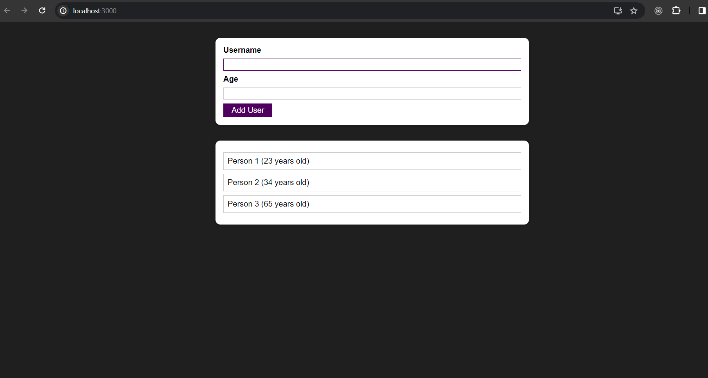

This code represents a user input form component in a React application. It allows users to input their name and age. It utilizes refs (useRef hook) to directly access the DOM input elements for name and age. The component manages errors using state (useState hook), displaying an error modal if validation fails. 

Domain: https://users-list-nine-eta.vercel.app/

